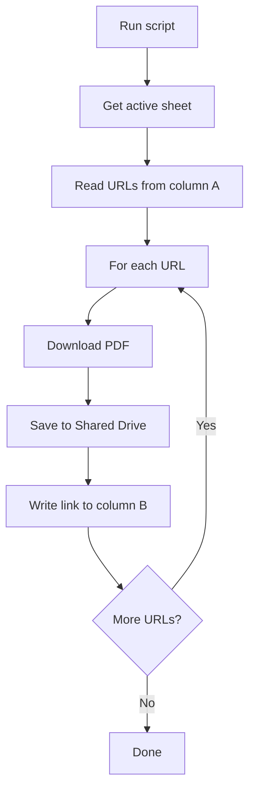
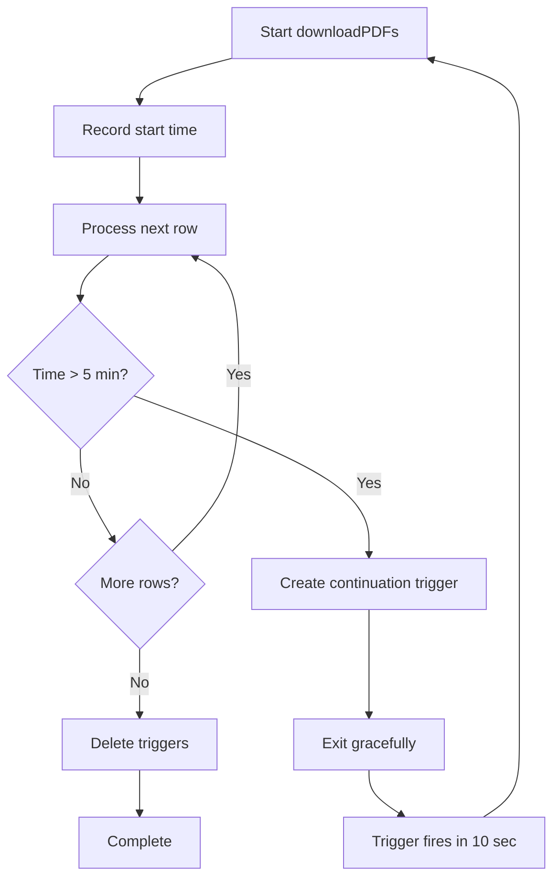

# Design Document: PDF Downloader Apps Script

## Overview

A simple Google Apps Script that reads URLs from column A, downloads PDFs, saves them to a Shared Drive folder, and writes shareable links to column B. The script is sheet-bound and can be run from the Apps Script editor or triggered manually.

## Architecture

### High-Level Flow



### Script Structure

Single file with:
1. **Configuration constants** at the top
2. **Main function** that orchestrates the process
3. **Helper functions** for download, save, and update operations

## Components and Interfaces

### Configuration Constants

```javascript
const SHARED_DRIVE_FOLDER_ID = 'your-folder-id-here';
const URL_COLUMN = 'C';        // Column containing PDF URLs
const LINK_COLUMN = 'D';       // Column to write shareable links
const START_ROW = 2;           // Skip header row
```

### Main Function

**Function**: `downloadPDFs()`
- Gets active sheet
- Reads URLs from URL_COLUMN starting at START_ROW
- For each URL:
  - Downloads PDF using UrlFetchApp
  - Saves to Shared Drive folder
  - Writes shareable link to LINK_COLUMN
- Logs errors to console

### Helper Functions

**Function**: `downloadPDF(url)`
- Uses UrlFetchApp.fetch() to get PDF
- Returns blob

**Function**: `savePDFToSharedDrive(blob, url, folderId)`
- Generates filename from URL or timestamp
- Creates file in Shared Drive folder using DriveApp
- Returns File object

**Function**: `getFileName(url)`
- Extracts filename from URL or generates timestamp-based name
- Returns string with .pdf extension

## Data Flow

1. Read all values from URL_COLUMN (starting at START_ROW)
2. Loop through each URL
3. Skip empty cells
4. Download PDF blob from URL
5. Save blob to Shared Drive folder
6. Get shareable link from saved file
7. Write link to LINK_COLUMN in same row
8. On error: log to console and continue to next URL

## Error Handling

- Use try-catch blocks around download and save operations
- Log errors to console with row number
- Continue processing remaining URLs if one fails
- Write "Error" or error message to LINK_COLUMN for failed downloads

## Testing Strategy

Manual testing:
1. Add test URLs to URL_COLUMN (column C)
2. Set SHARED_DRIVE_FOLDER_ID, URL_COLUMN, and LINK_COLUMN in script
3. Run downloadPDFs() from script editor
4. Verify PDFs appear in Shared Drive folder
5. Verify links appear in LINK_COLUMN (column D)
6. Check Apps Script logs for any errors

## Execution Time Management

### Problem
Google Apps Script has a 6-minute execution time limit. Processing hundreds of PDFs can exceed this limit.

### Solution: Smart Time Monitoring with Auto-Continuation



### Configuration

```javascript
const MAX_EXECUTION_TIME_MS = 5 * 60 * 1000; // 5 minutes (leave 1 min buffer)
const CONTINUATION_DELAY_MS = 10 * 1000; // 10 seconds between executions
const TRIGGER_FUNCTION_NAME = 'downloadPDFs';
const TRIGGER_UNIQUE_NAME = 'PDF_DOWNLOADER_CONTINUATION';
```

### Key Functions

**Function**: `shouldContinueProcessing(startTime)`
- Calculates elapsed time since start
- Returns false if elapsed time exceeds MAX_EXECUTION_TIME_MS
- Returns true otherwise

**Function**: `createContinuationTrigger()`
- Deletes any existing continuation triggers
- Creates new time-based trigger to run in 10 seconds
- Uses ScriptApp.newTrigger() with .timeBased().after(CONTINUATION_DELAY_MS)
- Sets unique name for easy identification

**Function**: `deleteContinuationTriggers()`
- Gets all project triggers
- Deletes triggers matching TRIGGER_UNIQUE_NAME
- Called when all processing is complete

### Modified Main Function Flow

1. Record start time at beginning of downloadPDFs()
2. Before processing each row, check shouldContinueProcessing()
3. If time limit approaching:
   - Log continuation message
   - Create continuation trigger
   - Exit function gracefully
4. If all rows processed:
   - Delete any continuation triggers
   - Log completion message

### Benefits

- Automatic handling of large datasets
- No user intervention required
- Resumes from exact stopping point (leverages existing incremental processing)
- Prevents timeout errors
- Self-cleaning (removes triggers when done)

## Implementation Notes

- Use UrlFetchApp.fetch() for downloading
- Use DriveApp.getFolderById() to access Shared Drive folder
- Use folder.createFile() to save PDFs
- Use file.getUrl() to get shareable link
- Process URLs sequentially (Apps Script is single-threaded)
- Script will request Drive permissions on first run
- Folder ID can be found in the Shared Drive folder URL
- Use ScriptApp.newTrigger() for time-based continuation
- Use Date.now() for time tracking
