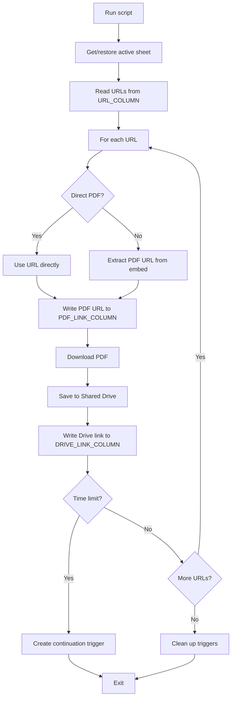
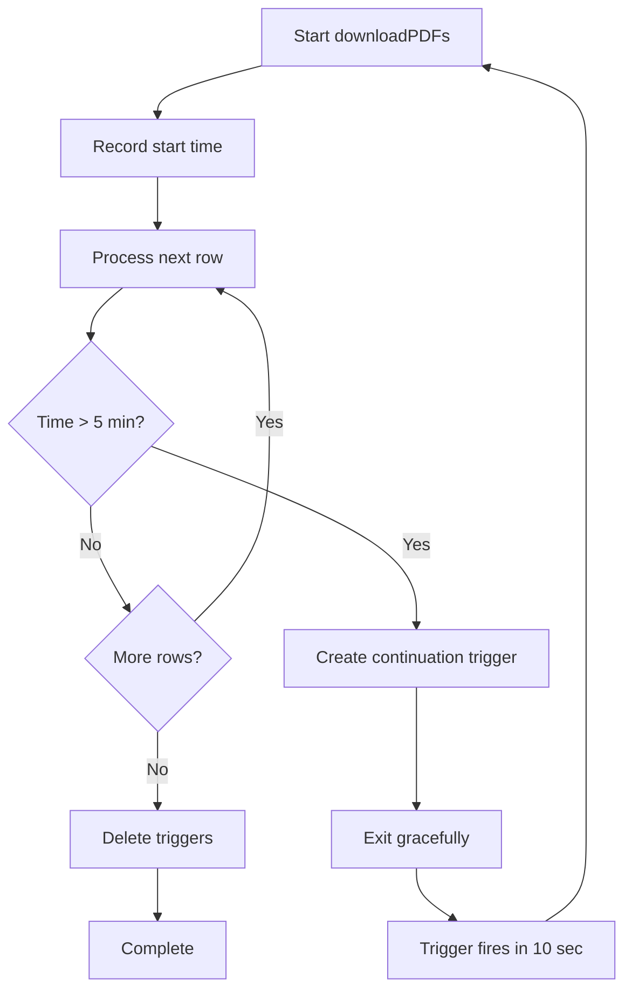

# Design Document: PDF Downloader Apps Script

## Overview

A simple Google Apps Script that reads URLs from column A, downloads PDFs, saves them to a Shared Drive folder, and writes shareable links to column B. The script is sheet-bound and can be run from the Apps Script editor or triggered manually.

## Architecture

### High-Level Flow



### Script Structure

Single file with:
1. **Configuration constants** at the top
2. **Main function** that orchestrates the process
3. **Helper functions** for download, save, and update operations

## Components and Interfaces

### Configuration Constants

```javascript
const SHARED_DRIVE_FOLDER_ID = 'your-folder-id-here';
const URL_COLUMN = 'C';           // Column containing PDF URLs or wrapper page URLs
const PDF_LINK_COLUMN = 'D';      // Column to write extracted PDF URLs
const DRIVE_LINK_COLUMN = 'E';    // Column to write Drive shareable links
const START_ROW = 2;              // Skip header row
const DIRECT_MODE = false;        // true = URLs are direct PDFs, false = URLs are wrapper pages
```

### Main Function

**Function**: `downloadPDFs()`
- Gets or restores active sheet (using PropertiesService for trigger-based execution)
- Stores sheet name in script properties for continuation
- Reads URLs from URL_COLUMN starting at START_ROW
- For each URL:
  - Checks if already processed (DRIVE_LINK_COLUMN has content)
  - Detects if URL is direct PDF or wrapper page
  - If direct PDF: uses URL as-is
  - If wrapper page: extracts PDF URL from embed tag
  - Writes extracted PDF URL to PDF_LINK_COLUMN
  - Downloads PDF using UrlFetchApp
  - Saves to Shared Drive folder
  - Writes shareable link to DRIVE_LINK_COLUMN
  - Checks execution time after each row
- Creates continuation trigger if time limit approached
- Cleans up triggers when complete
- Logs errors to console

### Helper Functions

**Function**: `isDirectPDFUrl(url)`
- Performs HEAD request to check Content-Type header
- Returns true if Content-Type is application/pdf
- Falls back to checking .pdf extension
- Returns false if detection fails (triggers embed extraction)

**Function**: `extractPDFUrl(url)`
- Fetches wrapper page HTML
- Parses for embed tag with type="application/pdf"
- Extracts src attribute
- Handles protocol-relative URLs
- Returns extracted PDF URL or null

**Function**: `downloadPDF(url)`
- Uses UrlFetchApp.fetch() to get PDF
- Returns blob

**Function**: `savePDFToSharedDrive(blob, url, folderId)`
- Generates filename from URL or timestamp
- Creates file in Shared Drive folder using DriveApp
- Returns File object

**Function**: `getFileName(url)`
- Extracts filename from URL or generates timestamp-based name
- Returns string with .pdf extension

## Data Flow

1. Get or restore active sheet (check PropertiesService for stored sheet name)
2. Store sheet name in script properties for continuation
3. Read all values from URL_COLUMN and DRIVE_LINK_COLUMN (starting at START_ROW)
4. Loop through each URL
5. Skip empty cells
6. Skip rows where DRIVE_LINK_COLUMN already has content (resume capability)
7. Detect if URL is direct PDF (HEAD request + Content-Type check)
8. If direct PDF: use URL as-is; if wrapper: extract PDF URL from embed tag
9. Write extracted/direct PDF URL to PDF_LINK_COLUMN
10. Download PDF blob from PDF URL
11. Save blob to Shared Drive folder
12. Get shareable link from saved file
13. Write Drive link to DRIVE_LINK_COLUMN in same row
14. Check execution time; create continuation trigger if needed
15. On error: log to console and continue to next URL
16. Clean up triggers when all rows processed

## Error Handling

- Use try-catch blocks around download and save operations
- Log errors to console with row number
- Continue processing remaining URLs if one fails
- Write "Error" or error message to LINK_COLUMN for failed downloads

## Testing Strategy

Manual testing:
1. Add test URLs to URL_COLUMN (column C)
2. Set SHARED_DRIVE_FOLDER_ID, URL_COLUMN, and LINK_COLUMN in script
3. Run downloadPDFs() from script editor
4. Verify PDFs appear in Shared Drive folder
5. Verify links appear in LINK_COLUMN (column D)
6. Check Apps Script logs for any errors

## Sheet Persistence for Trigger-Based Continuation

### Problem
When a time-based trigger fires, `getActiveSheet()` may not return the correct sheet since there's no active user session.

### Solution: PropertiesService for Sheet Name Persistence

```javascript
// At start of downloadPDFs()
const properties = PropertiesService.getScriptProperties();
let sheet;

// Check if we're resuming from a trigger
const storedSheetName = properties.getProperty('ACTIVE_SHEET_NAME');
if (storedSheetName) {
  sheet = spreadsheet.getSheetByName(storedSheetName);
  if (!sheet) {
    Logger.log('ERROR: Stored sheet "' + storedSheetName + '" not found');
    properties.deleteProperty('ACTIVE_SHEET_NAME');
    return;
  }
} else {
  // First run - get active sheet and store name
  sheet = spreadsheet.getActiveSheet();
  properties.setProperty('ACTIVE_SHEET_NAME', sheet.getName());
}

// After all processing complete
properties.deleteProperty('ACTIVE_SHEET_NAME');
```

### Benefits
- Ensures continuation triggers process the same sheet
- Handles both user-initiated and trigger-initiated executions
- Self-cleaning (removes property when done)

## Automatic PDF URL Detection

### Problem
Users may have mixed URL types: some direct PDF links, some wrapper pages with embeds.

### Solution: Smart Detection with HEAD Requests

```javascript
function isDirectPDFUrl(url) {
  try {
    // Perform HEAD request to check Content-Type
    const response = UrlFetchApp.fetch(url, {
      method: 'head',
      muteHttpExceptions: true,
      followRedirects: true
    });

    const contentType = response.getHeaders()['Content-Type'];
    if (contentType && contentType.includes('application/pdf')) {
      return true;
    }

    // Fallback: check file extension
    return url.toLowerCase().endsWith('.pdf');

  } catch (error) {
    // On error, assume wrapper page (safer default)
    return false;
  }
}
```

### Flow
1. For each URL, call `isDirectPDFUrl()`
2. If true: use URL directly, skip extraction
3. If false: call `extractPDFUrl()` to parse embed tag
4. Write result to PDF_LINK_COLUMN regardless of source

### Benefits
- No manual configuration needed
- Handles mixed URL types in same sheet
- Graceful fallback on detection failure
- Minimal performance impact (HEAD requests are fast)

## Execution Time Management

### Problem
Google Apps Script has a 6-minute execution time limit. Processing hundreds of PDFs can exceed this limit.

### Solution: Smart Time Monitoring with Auto-Continuation



### Configuration

```javascript
const MAX_EXECUTION_TIME_MS = 5 * 60 * 1000; // 5 minutes (leave 1 min buffer)
const CONTINUATION_DELAY_MS = 10 * 1000; // 10 seconds between executions
const TRIGGER_FUNCTION_NAME = 'downloadPDFs';
const TRIGGER_UNIQUE_NAME = 'PDF_DOWNLOADER_CONTINUATION';
```

### Key Functions

**Function**: `shouldContinueProcessing(startTime)`
- Calculates elapsed time since start
- Returns false if elapsed time exceeds MAX_EXECUTION_TIME_MS
- Returns true otherwise

**Function**: `createContinuationTrigger()`
- Deletes any existing continuation triggers
- Creates new time-based trigger to run in 10 seconds
- Uses ScriptApp.newTrigger() with .timeBased().after(CONTINUATION_DELAY_MS)
- Sets unique name for easy identification

**Function**: `deleteContinuationTriggers()`
- Gets all project triggers
- Deletes triggers matching TRIGGER_UNIQUE_NAME
- Called when all processing is complete

### Modified Main Function Flow

1. Record start time at beginning of downloadPDFs()
2. Before processing each row, check shouldContinueProcessing()
3. If time limit approaching:
   - Log continuation message
   - Create continuation trigger
   - Exit function gracefully
4. If all rows processed:
   - Delete any continuation triggers
   - Log completion message

### Benefits

- Automatic handling of large datasets
- No user intervention required
- Resumes from exact stopping point (leverages existing incremental processing)
- Prevents timeout errors
- Self-cleaning (removes triggers when done)

## Implementation Notes

- Use UrlFetchApp.fetch() for downloading and HEAD requests
- Use DriveApp.getFolderById() to access Shared Drive folder
- Use folder.createFile() to save PDFs
- Use file.getUrl() to get shareable link
- Use PropertiesService.getScriptProperties() to persist sheet name between executions
- Process URLs sequentially (Apps Script is single-threaded)
- Script will request Drive permissions on first run
- Folder ID can be found in the Shared Drive folder URL
- Use ScriptApp.newTrigger() for time-based continuation
- Use Date.now() for time tracking
- HEAD requests should use muteHttpExceptions: true for graceful fallback
- Check Content-Type header for 'application/pdf' to detect direct PDFs
- Store sheet name at start of execution, retrieve on trigger-based continuation
- Clear sheet name from properties after successful completion
